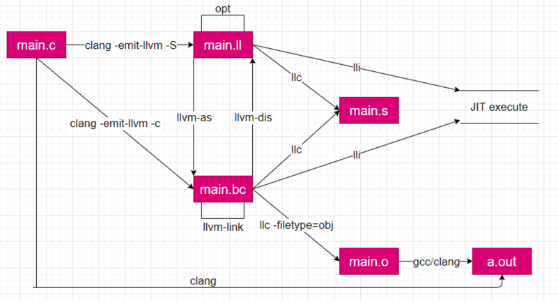

[toc]

## 目录

- [目录](#目录)
- [bookstack :](#bookstack-)
- [常用链接](#常用链接)
- [llvm的安装：](#llvm的安装)
  - [基于通过源码构建](#基于通过源码构建)
- [llvm工程项目配置：](#llvm工程项目配置)
  - [cmake工程的配置：](#cmake工程的配置)
    - [llvm 工具链](#llvm-工具链)

## bookstack :

* https://www.bookstack.cn/explore?cid=270&tab=popular
* https://www.bookstack.cn/books/llvm-guide-zh

## 常用链接

* [llvm.org](https://llvm.org/)
* [llvm.org.doc](https://llvm.org/docs)
* [git@llvm-project](https://github.com/llvm/llvm-project)
* LLVM系列 [飞翼剑仆](https://blog.csdn.net/Zhanglin_Wu/article/details/124942823)
* Creating an [LLVM Project](https://llvm.org/docs/Projects.html#overview)
* https://www.bookstack.cn/read/CTF-All-In-One/SUMMARY.md

## llvm的安装：

### 基于通过源码构建

* git clone --depth 1 https://github.com/llvm/llvm-project.git
* 发现使用ssh比hppts带宽大，并且push的时候，也不会出问题

```bash
cd llvm-project
mkdir build
cd build
cmake -G <generator> -DCMAKE_BUILD_TYPE=<type> [options] ../llvm
Ninja -j12
Ninja install


cmake -G Ninja  -DCMAKE_BUILD_TYPE=Release \
                -DLLVM_ENABLE_PROJECTS="clang;flang" \
                -DLLVM_ENABLE_RUNTIMES="libcxx;libcxxabi" \
                -DCMAKE_INSTALL_PREFIX=/usr/local \
                ../llvm


CMake Error at CMakeLists.txt:96 (MESSAGE):
  clang, flang isn't a known project:
  bolt;clang;clang-tools-extra;compiler-rt;cross-project-tests;libc;libclc;libcxx;libcxxabi;libunwind;lld;lldb;mlir;openmp;polly;pstl;flang
```

## llvm工程项目配置：

### cmake工程的配置：

* Embedding LLVM in your [project](https://llvm.org/docs/CMake.html#id18)
* some other [References](https://github.com/randyli/luac/blob/master/demos/llvmtest/CMakeLists.txt)

```bash
cmake -B build -G Ninja -DCMAKE_VERBOSE_MAKEFILE=ON
cmake --build build
```

#### llvm 工具链

<!-- [](https://star-history.com/#guodongxiaren/README&Date) -->

 
