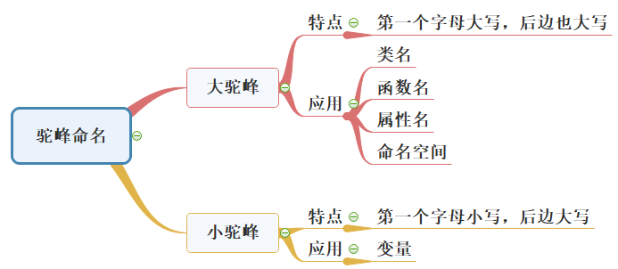

[toc]

---

代码规范化的第一个好处就是看着很整齐、很舒服。假如你现在用不规范的方式写了一万行代码，**现在能看得懂，但等过了三个月你再回头看时就很吃力了，更不要说给别人看了**。所以代码要写规范，比如加注释就是代码规范化的一个思想。

在一般情况下，根据软件工程的思想，我们的**注释要占整个文档的20%**以上。所以注释要写得很详细，而且格式要写得很规范。

> 采用统一的编程风格有利于：
> 一、规范的代码可以促进团队合作
> 二、规范的代码可以减少bug处理
> 三、规范的代码可以降低维护成本
> 四、规范的代码有助于代码审查
> 五、养成代码规范的习惯，有助于程序员自身的成长

---

## 目录

* [说明](#说明)
* [驼峰命名法](#驼峰命名法)
* [常量和宏通常应当都是大写](#常量和宏通常应当都是大写)
* [头文件](#头文件)
* [宏](#宏)
* [缩进](#缩进)
* [注释](#注释)
* [涉及C++属性的最常用编程规范](#涉及C++属性的最常用编程规范)
* [参考连接](#参考连接)

---

### 说明

* 编程规范可以是很厚很厚的一本书， 设计非常多的细节，但是常用的编程规范不多；
* 涉及一些不常用的编程规范，大家可以查看提供的文档，或者上网搜索；
* **没有必要死抠每一条规范**，真的耗时巨大，如果陷入其中，相当于南辕北辙，舍近求远；

我们应该把握编程逻辑 和 代码规范的平衡，不能只顾一边。为了促进实验室团队合作，减少代码规范的学习成本（编程风格需日积月累），推荐一下常用的C/C++的编程规范。

### 变量命名法

#### 采用驼峰格式命名法



大驼峰法:常用于**类名**，**函数名**，**属性**，**命名空间**
小驼峰法:常用于**变量**


#### 常量和宏通常应当都是大写
```c
const int CLK_TIMES = 100;      // 局部常量全大写
const int g_CLK_TIMES = 100;    // 全局常量 加上 g_
#define CLK_TIMES (100)
```

#### 用正确的反义词组命名具有互斥意义的变量或相反动作的函数等

示例：

```bash
add/remove            begin/end       create/destroy
insert/delete         first/last      get/release
increment/decrement   put/get         add/delete
lock/unlock           open/close      min/max
old/new               start/stop      next/previous
source/target         show/hide       send/receive
source/destination    copy/paste      up/down
```

#### 常见的通用缩写

| argument      | 可缩写为 | arg  |
| :------------ | -------- | ---- |
| buffer        | 可缩写为 | buff |
| clock         | 可缩写为 | clk  |
| command       | 可缩写为 | cmd  |
| compare       | 可缩写为 | cmp  |
| configuration | 可缩写为 | cfg  |
| device        | 可缩写为 | dev  |
| error         | 可缩写为 | err  |
| hexadecima    | 可缩写为 | hex  |
| increment     | 可缩写为 | inc  |
| initialize    | 可缩写为 | init |
| maximum       | 可缩写为 | max  |
| message       | 可缩写为 | msg  |
| minimum       | 可缩写为 | min  |
| parameter     | 可缩写为 | para |
| previous      | 可缩写为 | prev |
| register      | 可缩写为 | reg  |
| semaphore     | 可缩写为 | sem  |
| statistic     | 可缩写为 | stat |
| synchronize   | 可缩写为 | sync |
| temp          | 可缩写为 | tmp  |

#### 除了常见的通用缩写以外，不使用单词缩写，不得使用汉语拼音

使用英文全拼命名，不是使用自己认为的缩写（避免别人看不懂）


#### 尽量避免名字中出现*数字编号*(魔鬼数字)，除非逻辑上的确需要编号

#### 全局变量应增加“g_” 前缀，静态变量应增加“s_”


#### 禁止使用单字节命名变量，但允许定义i 、j、k作为局部循环变量

### 头文件

对于C语言来说，**头文件的设计体现了大部分的系统设计**。 不合理的头文件布局是编译时间过长的根因，不合理的头文件实际上反映了不合理的设计。

#### 每一个.c文件应有一个同名.h文件，用于声明需要对外公开的接口

#### 禁止在头文件中定义变量

在头文件中定义变量，将会由于头文件被其他.c文件包含而导致变量重复定义。

#### 头文件要避免多次包含

```c
#ifndef __TIMER_H__
#define __TIMER_H__
...
#endif
```

### 宏

用宏定义表达式时，要使用完备的括号

```c
#define RECTANGLE_AREA(a, b) a * b
#define RECTANGLE_AREA(a, b) (a * b)
#define RECTANGLE_AREA(a, b) (a) * (b)
正确的定义应为：
#define RECTANGLE_AREA(a, b) ((a) * (b))
```

### 缩进

统一 一次 缩进为 4个空格

### 注释

#### 注释原则一

注释的内容要清楚、明了，含义准确，防止注释二义性

#### 注释原则二

优秀的代码不写注释也可轻易读懂，**注释无法把糟糕的代码变好**，需要很多注释来解释的代码往往存在坏味道，需要重构。

错误示例：**注释不能消除代码的坏味道：**

```c
/* 判断m是否为素数*/
/* 返回值：: 是素数，: 不是素数*/
int p(int m)
{
    int k = sqrt(m);
    for (int i = 2; i <= k; i++)
        if (m % i == 0)
            break; /* 发现整除，表示m不为素数，结束遍历*/
    /* 遍历中没有发现整除的情况，返回*/
    if (i > k)
        return 1;
    /* 遍历中没有发现整除的情况，返回*/
    else
        return 0;
}
```

重构代码后，不需要注释：

```c
int IsPrimeNumber(int num)
{
    int sqrt_of_num = sqrt (num);
    for (int i = 2; i <= sqrt_of_num; i++)
    {
        if (num % i == 0)
        {
            return FALSE;
        }
    }
    return TRUE;
}
```

### 涉及C++属性的最常用编程规范

#### 类的命名相关

* **类名称**以大写字母开头，例如：class Customer;
* **对象名称**以小写字母开头；
* “驼峰规则”的方式构造多单词的名称，例如：class DataLoader, void getCustomerInfo()；
* 常量应当大写并且尽可能在类的作用域内创建成枚举类型，全局常量和宏通常应当都是大写；
* 每一个类名称都应当是一个名词或名词短语，例如：class LargeFurryMammal；
* 每一个函数名称都应当是一个动词或动词短语，例如：processBookOrder()；
* 用于if()语句时，每一个布尔变量都应当近似于一个句子，例如，bool isSuccess();

#### 类中的数据成员的命名

* 类的数据成员，以小写字母m开头，例如：m_Color, m_Width；
* 类的静态数据成员，以小写字母s开头，例如：s_Singleton, s_MemberCount；
* 非布尔型的类属性获取器，以get或属性名命名，例如：color()或getColor()；
* 布尔型的类属性获取器，以is开头，近似一个句子，例如：isChecked()或isValid()；
* 类属性的设置器，以set开头，例如：setColor(const Color& newColor)；

---

### 参考连接

[知乎-C语言编程规范](zhihu-c)
[csdn-C语言编程规范](csdn-c)
[大驼峰命名法和小驼峰命名法](csdn-camel)
[常见的C语言编程规范](c-rule)
[C/C++命名风格及约定](c-rule)

---


---

[zhihu-c]: https://zhuanlan.zhihu.com/p/346160926
[csdn-c]: https://blog.csdn.net/taoking123/article/details/124492176
[csdn-camel]: https://blog.csdn.net/jerry11112/article/details/84985026
[c-rule]: https://cloud.tencent.com/developer/article/1693532
[c/c++-rule]: https://blog.csdn.net/cchmsn/article/details/124780743?ops_request_misc=&request_id=&biz_id=102&utm_term=%E7%BB%9F%E4%B8%80%E5%91%BD%E5%90%8D%E9%A3%8E%E6%A0%BC%E7%9A%84%E5%A5%BD%E5%A4%84&utm_medium=distribute.pc_search_result.none-task-blog-2~all~sobaiduweb~default-2-124780743.142^v73^control,201^v4^add_ask,239^v2^insert_chatgpt&spm=1018.2226.3001.4187
